# Video Semantic Search System - High-Level Design (HLD)

## Architecture Diagram

```mermaid
graph TD
    %% Input Layer
    A[Video Files<br/>📹 .mp4, .avi, .mkv] --> B[Pipeline Controller<br/>🎯 pipeline.py]

    %% Configuration
    CONFIG[Configuration<br/>📋 config.yaml<br/>• Whisper settings<br/>• Embedding model<br/>• FAISS parameters<br/>• Search settings] --> B

    %% Step 1: Transcription
    B --> C[WhisperTranscriber<br/>🎤 transcriber.py]
    C --> C1[Load Whisper Model<br/>• Model size: base/medium/large<br/>• Device: CPU/GPU<br/>• Language: en]
    C1 --> C2[Batch Transcription<br/>• Audio extraction<br/>• Speech-to-text<br/>• Segment timestamps]
    C2 --> C3[JSON Transcripts<br/>📄 data/transcripts/<br/>• video_id<br/>• segments with timestamps<br/>• confidence scores<br/>• tokens]

    %% Step 2: Segmentation
    C3 --> D[TranscriptSegmenter<br/>✂️ embedder.py]
    D --> D1[Segment Processing<br/>• 30s segments<br/>• 5s overlap<br/>• Min/max length filtering]
    D1 --> D2[Segmented Data<br/>📊 List of segments<br/>• video_id<br/>• start_time/end_time<br/>• text content<br/>• context]

    %% Step 3: Embedding Generation
    D2 --> E[EmbeddingGenerator<br/>🧠 embedder.py]
    E --> E1[Load Sentence Transformer<br/>• Model: all-MiniLM-L6-v2<br/>• Normalize embeddings<br/>• Batch processing]
    E1 --> E2[Generate Embeddings<br/>• Text → Vector conversion<br/>• 384-dimensional vectors<br/>• Batch size: 32]
    E2 --> E3[Embeddings Array<br/>📈 data/embeddings/<br/>• numpy array<br/>• metadata JSON<br/>• segment mappings]

    %% Step 4: FAISS Index Building
    E3 --> F[FAISSIndexBuilder<br/>⚡ embedder.py]
    F --> F1[Create FAISS Index<br/>• IndexFlatIP<br/>• Cosine similarity<br/>• Memory optimization]
    F1 --> F2[FAISS Index File<br/>🗂️ data/index/<br/>• Fast similarity search<br/>• Compressed storage<br/>• Sub-second queries]

    %% Search Engine
    F2 --> G[VideoSearchEngine<br/>🔍 searcher.py]
    G --> G1[Load Components<br/>• FAISS index<br/>• Embeddings<br/>• Segments metadata<br/>• Sentence transformer]

    %% Query Processing
    H[User Query<br/>💭 Python functions] --> G2[Query Processing<br/>• Text cleaning<br/>• Embedding generation<br/>• FAISS search]
    G1 --> G2
    G2 --> G3[Similarity Search<br/>• Top-k results<br/>• Threshold filtering<br/>• Context extraction]
    G3 --> G4[Search Results<br/>📋 Ranked segments<br/>• Similarity scores<br/>• Video timestamps<br/>• Text content<br/>• Context]

    %% Interface Layer
    G4 --> I1[CLI Interface<br/>💻 searcher.py main]
    G4 --> I2[Web API<br/>🌐 api.py Flask]
    G4 --> I3[Python Library<br/>🐍 Direct usage]

    %% Web Interface Details
    I2 --> I2A[Flask Routes<br/>• /api/search<br/>• /api/stats<br/>• /api/videos<br/>• / web UI]
    I2A --> I2B[Web Interface<br/>🖥️ HTML/CSS/JS<br/>• Search box<br/>• Results display<br/>• Video listings<br/>• Statistics]

    %% Data Storage
    subgraph "Data Storage 💾"
        DS1[Videos Directory<br/>📁 videos/]
        DS2[Transcripts<br/>📁 data/transcripts/]
        DS3[Embeddings<br/>📁 data/embeddings/]
        DS4[FAISS Index<br/>📁 data/index/]
        DS5[Logs<br/>📁 logs/]
    end

    %% Utilities
    subgraph "Utilities 🛠️"
        U1[Config Manager<br/>• YAML parsing<br/>• Settings validation]
        U2[Logging Setup<br/>• Colored output<br/>• File logging]
        U3[Helper Functions<br/>• File operations<br/>• Text processing<br/>• Progress tracking]
    end

    %% Key Classes
    subgraph "Core Classes 🏗️"
        CL1[WhisperTranscriber<br/>• Model loading<br/>• Batch processing<br/>• Memory management]
        CL2[TranscriptSegmenter<br/>• Time-based segmentation<br/>• Overlap handling]
        CL3[EmbeddingGenerator<br/>• Sentence transformer<br/>• Batch embedding]
        CL4[FAISSIndexBuilder<br/>• Index creation<br/>• Search optimization]
        CL5[VideoSearchEngine<br/>• Query processing<br/>• Result ranking]
        CL6[VideoSearchAPI<br/>• Flask endpoints<br/>• Web interface]
    end

    %% Styling
    classDef input fill:#e1f5fe
    classDef processing fill:#f3e5f5
    classDef storage fill:#e8f5e8
    classDef interface fill:#fff3e0
    classDef config fill:#fce4ec

    class A,H input
    class C,D,E,F,G processing
    class DS1,DS2,DS3,DS4,DS5 storage
    class I1,I2,I2A,I2B,I3 interface
    class CONFIG,U1,U2,U3 config
```



## System Overview

This video semantic search system enables users to search through video content using natural language queries. The system processes videos through a multi-stage pipeline to create a searchable index of video segments.

## Core Architecture Components

### 1. Data Processing Pipeline (4 Main Steps)

#### **Step 1: Video Transcription**
- **Class:** `WhisperTranscriber` (transcriber.py)
- **Function:** Converts video audio to text using OpenAI Whisper
- **Key Features:**
  - Supports multiple model sizes (base/medium/large)
  - Configurable parameters (temperature, beam_size, etc.)
  - Batch processing with memory management
  - Device selection (CPU/GPU)
- **Output:** JSON transcripts with timestamps, confidence scores, and tokens

#### **Step 2: Transcript Segmentation**
- **Class:** `TranscriptSegmenter` (embedder.py)
- **Function:** Breaks long transcripts into searchable chunks
- **Key Features:**
  - 30-second segments with 5-second overlap
  - Configurable min/max segment lengths (10-60 seconds)
  - Maintains video context and timestamps
- **Output:** List of segmented text chunks with metadata

#### **Step 3: Embedding Generation**
- **Class:** `EmbeddingGenerator` (embedder.py)
- **Function:** Converts text segments to numerical vectors
- **Key Features:**
  - Uses sentence-transformers (all-MiniLM-L6-v2)
  - 384-dimensional vectors
  - Batch processing for efficiency
  - Normalized embeddings for better similarity search
- **Output:** Numpy arrays of embeddings with metadata

#### **Step 4: FAISS Index Building**
- **Class:** `FAISSIndexBuilder` (embedder.py)
- **Function:** Creates fast similarity search index
- **Key Features:**
  - Uses IndexFlatIP for cosine similarity
  - Optimized for sub-second query responses
  - Compressed storage for large datasets
  - Memory-efficient operations
- **Output:** FAISS index file for fast similarity search

### 2. Search Engine

#### **VideoSearchEngine** (searcher.py)
- **Core search functionality:**
  - Loads FAISS index, embeddings, and metadata
  - Processes user queries into embeddings
  - Performs similarity search with configurable parameters
  - Returns ranked results with context and timestamps
- **Key Methods:**
  - `search()` - Main search function
  - `search_by_video()` - Search within specific video
  - `load_index()` - Load search components
  - `get_stats()` - System statistics

### 3. User Interfaces

#### **Three Access Methods:**

1. **CLI Interface** (searcher.py main)
   - Command-line search tool
   - Direct query execution
   - Statistics and video listing

2. **Web API** (api.py Flask)
   - REST API endpoints
   - JSON responses
   - CORS enabled for web access

3. **Python Library**
   - Direct programmatic access
   - Integration with other Python projects

#### **Web Interface Features:**
- Search box with real-time results
- Video listings and statistics
- Configurable search parameters (top-k, threshold)
- Responsive HTML/CSS/JS interface
- Sample query suggestions

### 4. Configuration & Utilities

#### **Config Manager** (utils.py)
- YAML-based configuration system
- Dot notation access (e.g., 'whisper.model_size')
- Manages all component settings
- Validates parameters and ensures directories

#### **Utility Functions:**
- Logging setup with colored output
- File operations and text processing
- Progress tracking for long operations
- Video file validation
- Timestamp formatting

### 5. Data Storage Structure

```
SuperBrynTask/
├── videos/                    # Original video files
├── data/
│   ├── transcripts/          # JSON transcript files
│   ├── embeddings/           # Numpy arrays and metadata
│   └── index/                # FAISS index files
├── logs/                     # Application logs
└── config.yaml               # Configuration file
```

## Key Classes and Their Responsibilities

### **Core Classes:**

1. **WhisperTranscriber**
   - Model loading and management
   - Batch processing with memory optimization
   - Error handling and cleanup

2. **TranscriptSegmenter**
   - Time-based segmentation
   - Overlap handling for context preservation
   - Segment filtering and validation

3. **EmbeddingGenerator**
   - Sentence transformer management
   - Batch embedding generation
   - Normalization and storage

4. **FAISSIndexBuilder**
   - Index creation and optimization
   - Search parameter tuning
   - Memory-efficient operations

5. **VideoSearchEngine**
   - Query processing and embedding
   - Similarity search execution
   - Result ranking and context extraction

6. **VideoSearchAPI**
   - Flask endpoints and routing
   - Web interface serving
   - Error handling and logging

## Key Features

1. **Scalable Architecture** - Handles large video collections efficiently
2. **Fast Search** - Sub-second query responses via FAISS indexing
3. **Semantic Understanding** - Finds relevant content beyond keyword matching
4. **Multiple Interfaces** - CLI, Web, and Python API access
5. **Configurable** - Adjustable parameters for different use cases
6. **Memory Efficient** - Optimized for large datasets with proper cleanup
7. **Context Aware** - Returns surrounding context for better understanding
8. **Robust Error Handling** - Comprehensive logging and error management

## Workflow Summary

1. **Input:** Video files → **Pipeline Controller** (pipeline.py)
2. **Transcription:** Videos → Text with timestamps (WhisperTranscriber)
3. **Segmentation:** Long transcripts → Searchable chunks (TranscriptSegmenter)
4. **Embedding:** Text segments → Numerical vectors (EmbeddingGenerator)
5. **Indexing:** Vectors → Fast searchable index (FAISSIndexBuilder)
6. **Search:** User query → Relevant video segments (VideoSearchEngine)
7. **Output:** Ranked results with timestamps and context

## Configuration Parameters

### **Whisper Settings:**
- Model size: tiny, base, small, medium, large
- Language: en (configurable)
- Device: auto, cpu, cuda
- Temperature, beam_size, patience, etc.

### **Embedding Settings:**
- Model: all-MiniLM-L6-v2 or all-mpnet-base-v2
- Batch size: 32 (configurable)
- Normalization: enabled

### **Search Settings:**
- Top-k results: 5 (configurable)
- Similarity threshold: 0.3
- Context window: 10 seconds

### **FAISS Settings:**
- Index type: IndexFlatIP (cosine similarity)
- Dimension: 384 or 768 (model-dependent)
- Memory optimization parameters

This architecture provides a complete end-to-end solution for semantic video search, transforming raw video files into an intelligent, searchable knowledge base.